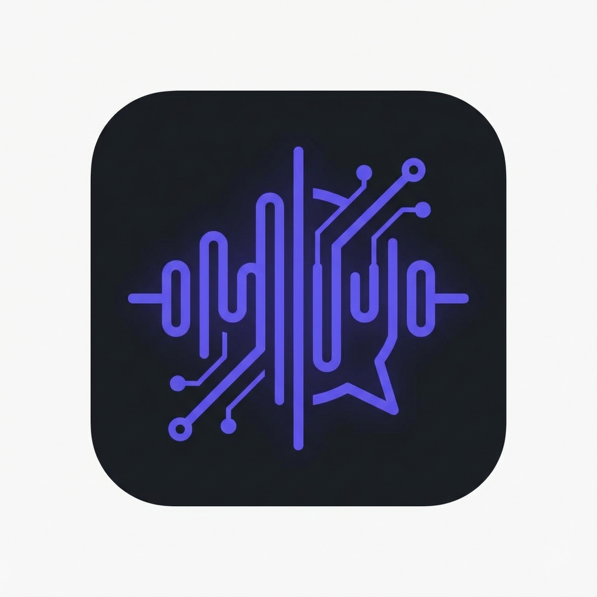

# Omi Local (Omibutfree)

<div align="center">



**The Open Source, Privacy-First Companion for Omi Devices.**

[](https://flutter.dev)
[]()
[]()
[]()

[Features](#features) • [Installation](#installation) • [Architecture](#architecture) • [Roadmap](#roadmap)

</div>

---

## 🚀 Overview

**Omi Local** is a fully functioning, self-hosted alternative to the official Omi app. It is designed for users who want full control over their data, zero monthly subscriptions, and a powerful local-first AI experience.

It connects directly to your Omi hardware (Friend/DevKit) via Bluetooth Low Energy (BLE) and processes audio entirely on your terms—whether that's using local Whisper models on your iPhone or your own private API keys for Cloud transcription.

## ✨ Features

### 🔒 Privacy & Sovereignty

- **100% Local Storage**: All memories, tasks, and conversations live in a SQLite database on your device.
- **Your Keys, Your Model**: Bring your own OpenAI/Deepgram keys. No middleman servers.
- **Offline Capable**: Use local Whisper models to transcribe audio without an internet connection.
- **Export All Data**: Export your entire database as JSON anytime.
- **iCloud Backup**: Optional sync across your devices.

### 🧠 Advanced AI

- **Memories**: Automatically extracts important facts. Edit or add memories manually by selecting text.
- **Actionable Tasks**: Detects promises and to-dos with scheduled local notifications.
- **Hold-to-Ask**: Hold the Omi button to chat with your AI assistant in real-time.

### ⚡️ Modern Hardware Integration

- **Direct BLE Connection**: Low-latency audio streaming from Omi devices.
- **Battery Notifications**: Alerts at 50% and 20% battery levels.
- **Device Management**: View battery life, adjust mic gain, and LED dimming.

### 🎨 Premium Experience

- **Dark Mode UI**: Polished design with smooth animations.
- **Conversation Search**: Find past conversations instantly.
- **Duration Display**: See how long each conversation lasted.
- **Statistics Dashboard**: Track your usage with conversation counts, word totals, and more.
- **Notification Controls**: Toggle every notification type individually.

## 🛠 Tech Stack

- **Framework**: Flutter (Dart)
- **Database**: SQLite (sqflite)
- **Bluetooth**: Flutter Blue Plus
- **Audio Codec**: Opus (Custom decoder)
- **Local AI**: Sherpa-ONNX (Streaming), Whisper (Batch)
- **Cloud AI**: Deepgram (STT), OpenAI (LLM)

## 📦 Installation

### Prerequisites

- macOS with Xcode installed
- iPhone (Developer Mode enabled)
- Omi Device (Friend or DevKit)

### Quick Start

1. **Clone the repo**

   ```bash
   git clone https://github.com/kbdevs/omibutfree.git
   cd omibutfree
   ```

2. **Install Dependencies**

   ```bash
   flutter pub get
   cd ios && pod install && cd ..
   ```

3. **Run on Device**
   Connect your iPhone via USB.

   ```bash
   flutter run --release
   ```

4. **Configure**
   Go to **Settings** in the app to add your OpenAI API Key and choose your transcription model.

## 🗺 Roadmap

- [x] **Core**: BLE Audio, Live Transcription, Database
- [x] **AI**: Memories, Tasks, Local Notifications
- [x] **Hardware**: Battery, Haptics, Device Info
- [x] **v2.1.0**: Edit Memories, Search, Export, Stats, Notification Settings
- [ ] **Integrations**: Google Calendar, Notion, Apple Reminders
- [ ] **Voice**: Speaker Diarization (Train to recognize your voice)
- [ ] **Sync**: Robust SD Card file synchronization

## 🤝 Contributing

This project is open source and free forever. We welcome contributions!

1. Fork the Project
2. Create your Feature Branch (`git checkout -b feature/AmazingFeature`)
3. Commit your Changes (`git commit -m 'Add some AmazingFeature'`)
4. Push to the Branch (`git push origin feature/AmazingFeature`)
5. Open a Pull Request

---

**Built with ❤️ by KB Devs**
